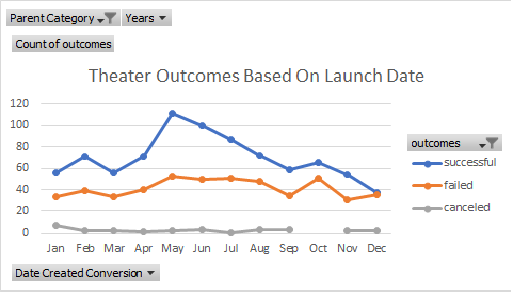
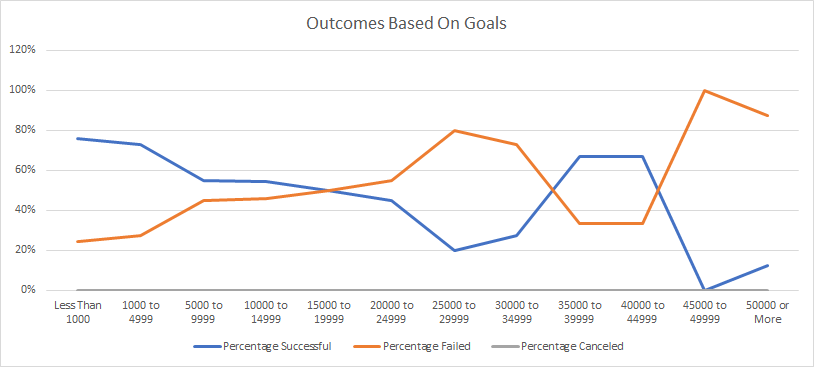

# Kickstarting with Excel

## Overview of Project
The project started with helping Louise, a playwright, setting up her crowdfunding campaign for her 
play "Fever".The goal of this project was to determine what factors can help her to reach her 
$10,000 goal and become successful in the funding. Using the Kickstarter dataset we are able 
to interpret wethere there is a correlation between different factors and success, faiure and 
cancellatio of a campaign. 
We have the data for different categories and subcategories and considering that Louise is interested 
in a campaign for her play, we can filter our studies to related categories and subcategories to 
determine what factors can lead such campaign  reach it's goal and becomes successful.

### Purpose
The purpose of this assignment is to help Louise understand if there is a relationship between a 
campaign's outcome considering it's launch date and funding goals using the Kickstarter dataset.
 

## Analysis and Challenges

### Theater Outcomes based on Lauch Date
In order to perform analysis for the outcome of the campaigns base on their launch date, first of
all I added a column to the Kickstarter data set and using the '=Year()' function of the Excel, 
I separated the year that each campaing was launched. Then, I created a pivot table with filters
for "year" and "parent category", showing the number of successful, failed and canceled campaigns 
and filtering to only "Theater" category. By using the data in this pivot table, I created a line chart showing the outcomes of theater campaigns based on their launch 
date to visualize any correlation.

#### Challenges
I didn't encounter any challenge during this part of the assignment. However, a potential challenge
could have been in removing the Quarters from the Pivot table and sorting the outcomes in a descending 
pattern.

### Outcomes Based on Goals
To perform the analysis for the outcome of campaigns based on their goals, I started by creating a 
new sheet and deviding the "goals" into different ranges. By using the '=COUNTIFS' function of Excel,
I separated the number of successful, failed and canceled campaigns of the "Plays" subcategory and 
calculated their percentage by using the '=SUM' function to determine the total number of each outcome.
Next, with this information I created a line chart to visualize the outcomes base on goals. 
Here is a sample of a function I used:

`=COUNTIFS(Kickstarter!F:F, "SUCCESSFUL", Kickstarter!D:D, "<1000", Kickstarter!R:R, "PLAYS")`

#### Challenges
A challenge that I encountered in this part was in writing the '=COUNTIFS' function for different ranges 
and by practicing and writing the function for different outcomes and ranges, I mastered the skill. 
I was doubting that there is a problem with the function I'm writing for canceled campaigns that 
they were all becoming zero but by checking the function a few times and double checking the 
dataset with filters, I confirmed the results.

### Analysis of Outcomes Based on Launch Date

Based on the analysis performed on the Kickstarter data and filtering the theater category and launch date,
it can be understand that campaigns that are launched in May, June and July are the most successful.
February, April, August have similar success rate and those that were launched in January, March,
September, October and November have similar success numbers. December campaigns have the lowest successful campaigns.
The cancellation numbers are not dependent to the launch date and are steady throughout the year.The only exception is October with zero canceled campaigns.

### Analysis of Outcomes Based on Goals

Considering the percentage of successful Plays crowdfunding projects based on their goals it is visible that the most successful percentage belongs to 
campaigns with goal of Less than $1000 and those with goal of $1000 to $4999. The most failed campaigns are 
those with goals of $45000 to $49999 and $50000 and more. There is no canceled play campaign for any of the goals.

### Challenges and Difficulties Encountered
I have addressed the challenges of each analysis above. However, a big challenge that I feel I have is in making conclusions by looking at the tables and
charts. I think this is really important and critical thinking and drawing a conclusion is a big part of this bootcamp.

## Results

- What are two conclusions you can draw about the Outcomes based on Launch Date?
Studying outcomes based on launch date will help to conclude:
1) Campaings that were launched in May and then June have the best successful outcome 
and the success lowers each months forward with December having the least successful campaigns based on the launch date. 
2) The cancellation rate is steady throughtout the year except for campaings that were launched in October that they had no cancellation.
All of this information can be viewed in the chart below.

- What can you conclude about the Outcomes based on Goals?

The campaigns with goals less than $1000 and $1000 to $4999 are relatively the most successful and the successful percentage
lowers as the goal goes higher with the exception of goals between $35000 to $44999. The goal alone, can't be the 
best factor to draw conclusion about the success of a campaign. 
This can be visualized in the chart below:

- What are some limitations of this dataset?

If we could use different factors from the dataset and study multifactorial relationships with campaign success, the conclusion
would have been more reliable. This dataset has lots of unnecessary information about the campaigns that are not related to what we are studying and
needs lots of filteration and cleaning. 
 
- What are some other possible tables and/or graphs that we could create?
The box and whisker graph to determine the outliers and central tendency of the data. 
